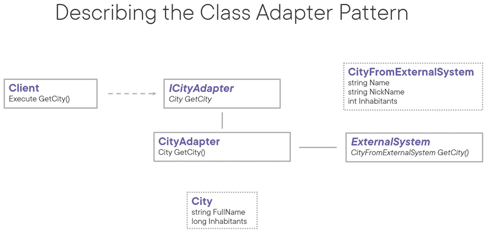

# Adapter (Wrapper) Pattern
The intent of this pattern is to convert the interface of a class into another interface clients expect. Adapter lets classes work together that couldn't otherwise because of incompatible interfaces.

Two types:
- Object adapter relies on composition
- Class adapter relies on multiple inheritance.
  - A true class adapter with multiple-inheritance isn't possible in C#, but a variation inheriting a class + interface simultaneously

## Object Adapter

## Class Adapter

Use cases:
- When you want to use an existing class but the interface does not match the one you need.
- When you want to create a reusable class (the adapter) that works with classes that don't have compatible interfaces.
- When you need to use several existing subclasses, don't want to create additional subclasses for each of them, but still need to adapt their interface.

Pattern consequences:
- A single adapter can work with many adaptees, and can add functionality to all adaptees at once.
- Single responsibiity principle (SRP) adhered to: the interface (adapter code) is seperated out from the rest of the code.
- Open/closed principle (OCP): new types of adapters can be introduced without breaking client code.
- The object adapter makes it hard to override adaptee behavior.
- Additional complexity is introduced.

Related patterns:
- Bridge: bridge separates interface from implementation, adapter changes the interface of an existing object.
- Decorator: decorator changes an object without changing its interface, adapter changes the interface of an object.
- Facade: with facade you define a new interface for an entire subsystem, with adapter you're making an existing interface usable via wrapping.
- Proxy: defines a surrogate for another object, but does not change its interface.