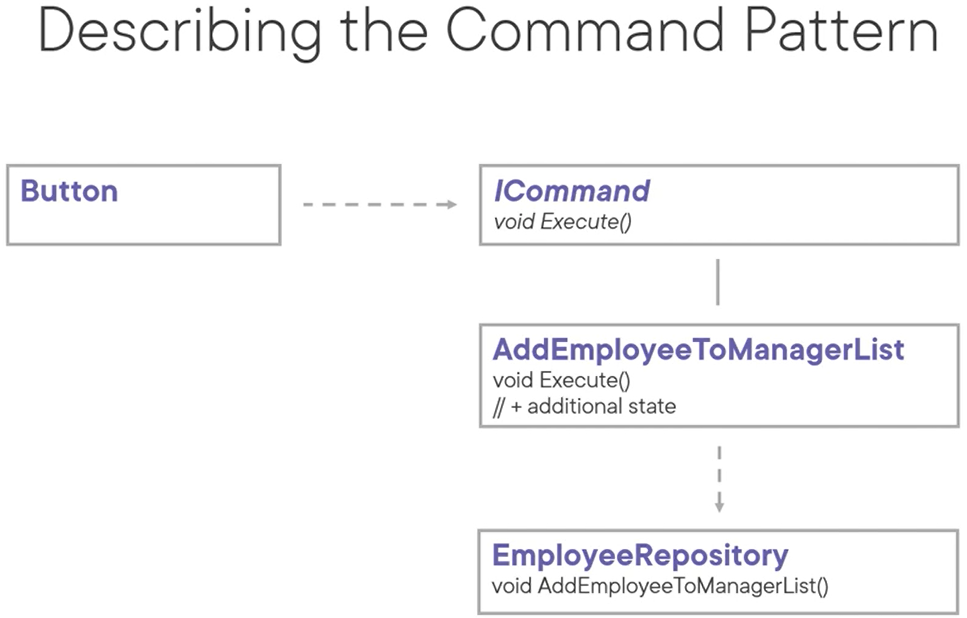

# Command Pattern
The intent of this pattern is to encapsulate a request as an object, thereby letting you parameterize clients with different requests, queue or log requests, and support undoable operations.

Allows decoupling the requester of an action from the receiver.
- Very common in mobile or rich UI development

Use cases:
- When you want to parameterize objects with an action to perform
- When you want to support undo or redo functionality
- When you want to specify, queue and execute requests at different times
- When you need to store a list of changes to potentially reapply later on (transaction log)

Pattern consequences:
- SRP: Decouples the class that invokes an operation from the one that knows how to perform it
- OCP: Existing implementations don't have to be changed to add new commands
- Commands can be manipulated and extended
- Commands can be assembled into a composite command
- Because an additional layer is added, complexity increases

Related patterns:
- Composite: can be used to implement commands composed of other commands
- Memento: can be used to store the state a command requires to undo its effect
- Prototype: In case of supporting undo, a command that must be copied acts as a prototype
- Chain of responsibility: handlers can be implemented as commands

Patterns that connect senders and receivers:
- Chain of Responsibility: passes a request along a chain of receivers
- Command: connects senders with receivers unidirectional (e.g. button in UI)
- Mediator: eliminates direct connections altogether
- Observer: allows receivers of requests to (un)subscribe at runtime