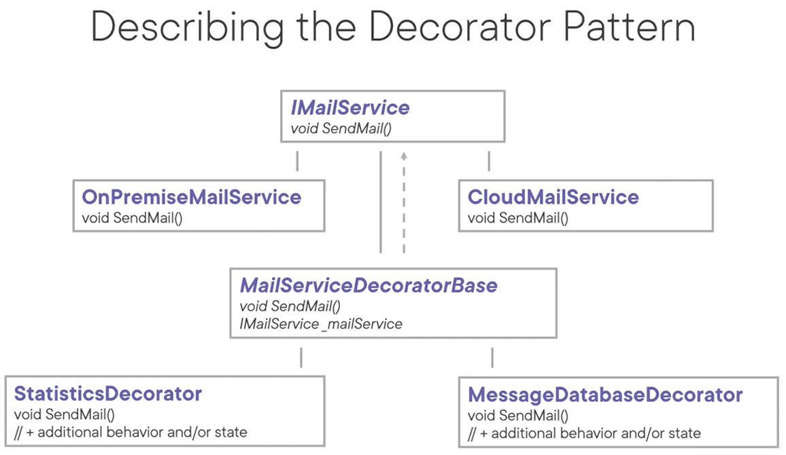
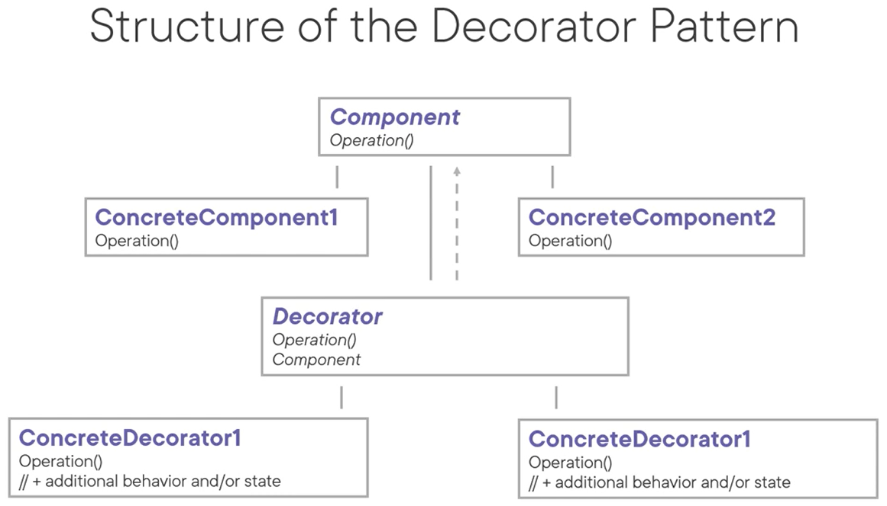

# Decorator Pattern
The intent of this pattern is to attach additional responsibilities to an object dynamically. A decorator thus provides a flexible alternative to subclassing for extending functionality.

Just like the adapter pattern, this pattern is sometimes called a wrapper.

