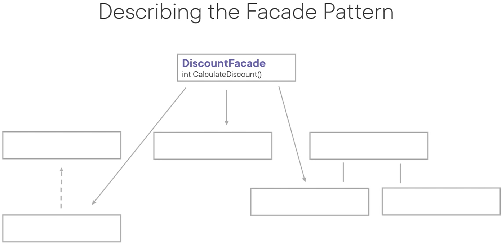
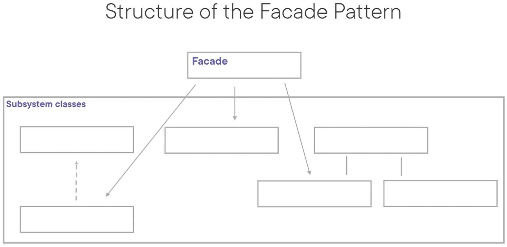

# Facade Pattern
The intent of this pattern is to provide a unified interface to a set of interfaces in a subsystem. It defines a higher-level interface that makes the subsystem easier to use.

The example below is a good candidate for putting a facade pattern in front of it to hide the complexity of a discount calculation and encourages re-use:

Use cases:
- When you want to provide a simple interface into a complex subsystem
- When there are many dependencies between a client and the implementation classes of the abstraction

Pattern consequences:
- The number of objects that the clients have to deal with are reduced
- OCP: it promotes weak coupling between the subsystem and its clients, enabling subsystem components to vary without affecting the client
- Clients are not forbidden to use subsystem classes

Related patterns:
- Abstract factory: can provide an interface for creating subsystem objects while remaining independent of the subsystem.
- Mediator: also abstracts functionality of existing classes, but its purpose is abstracting communication between objects, while facade is about promoting ease of use.
- Adapter: adapter makes an existing interface useable by wrapping one object, while with facade you're defining anew interface for an entire subsystem.
