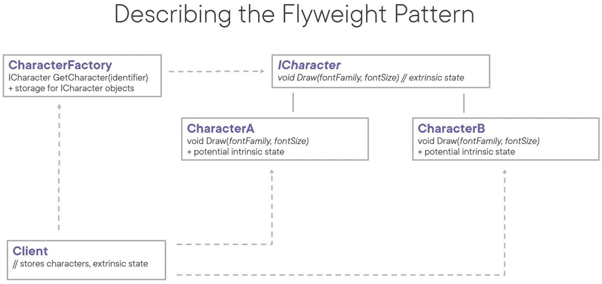
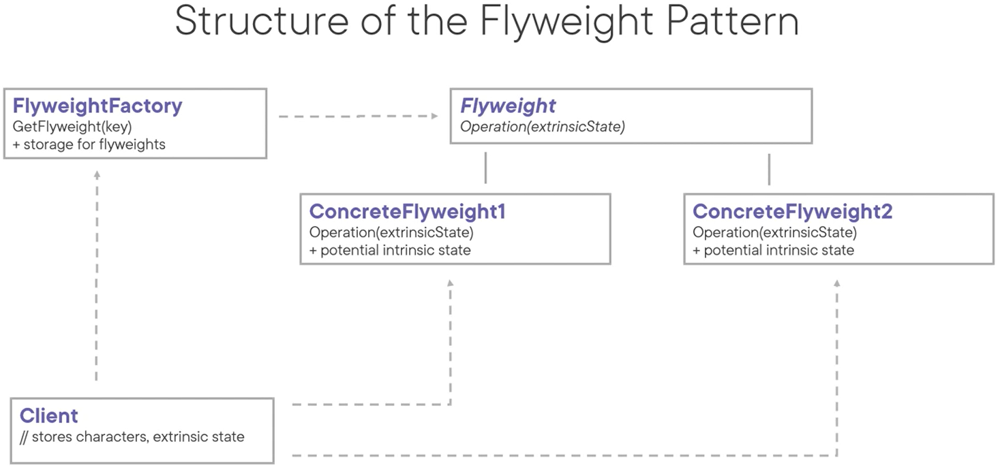

# Flyweight Pattern
The intent of this pattern is to use sharing to support large number of fine-grained objects efficiently. It does that by sharing parts of the state between these objects instead of keeping all that state in all of the objects.

Examples:
- Characters in a document
- A product management system with products with a fixed category that differ in weight and names
- An ordering system with a few intrinsic values per order
- A library system

Use cases:
- When the application uses a large number of objects
- When storage costs are high because of the large amount of objects
- When most of the object state can be made extrinsic
- When, if you remove extrinsic state, a large group of objects be replaced by relatively few shared objects
- When the application does not require object identity

Pattern consequences:
- You may save a lot of memory when using the pattern for applicable use case
- Processing costs might go up, but that's typically offset by reduced storage costs/memory use
- The pattern is complex, which makes the code base more complicated as well

Related patterns:
- State: state without instance variables makes these objects flyweights
- Strategy: can be implemented as a flyweight