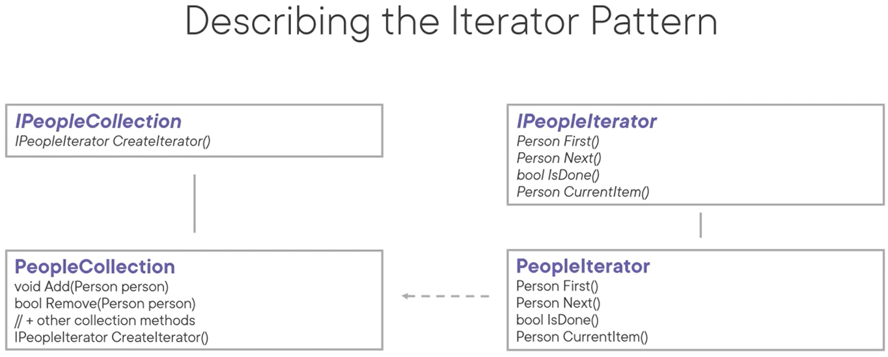

# Iterator Pattern
Think **ForEach**

The intent of this pattern is to provide a way to access the elements of an aggregate object (enumerable, array, collection) sequentially without exposing its underlying representation.

- Extremely common to use but not common to implement in day-to-day work as its a feature of most frameworks/languages
- Aggregate objects (List, Dictionary, Stack, Queue, ...) keep their items in an internal structure.
- You might not always want to traverse aggregate objects in the same wy
  - Alphabetically, reverse order, custom order, ...
- And you don't want to bloat the aggregate object interface with all these different ways of traversing it

Use cases:
- To access an aggregate objects content without exposing its internal representation
- Hide away complexity when working with a complicated data structure (complicated tree structure for example)
- When you want to support multiple ways of traversal for the same aggregate object
- When you want to avoid code duplication in regards to traversing the aggregate objects and the traversal code is complicated

Pattern consequences:
- SRP: iterators simply the interface of your aggregate structure as traversal code is seperated out
- OCP: you can implement new types of aggregate objects as iterators without interfering with each other
- Iterators can exist next to each other at the same time on the same collection
- Increases code complexity/can be a bit overkill when you only use simple traversals and collections

Related patterns:
- Composite: iterators are often used to traverse its recursive structure
- Memento: the memento can be used to store the state of the iterator and, potentially, roll it back
- Visitor: you can use an iterator to traverse a potentially complex data structure, and apply logic to the items in that structure with a visitor