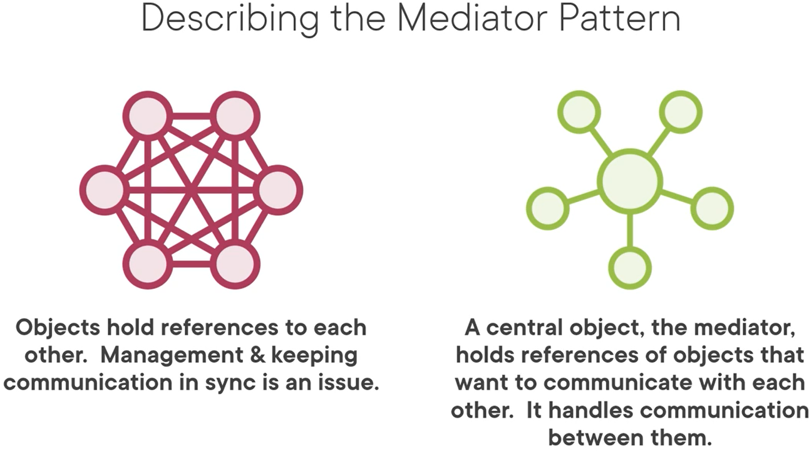
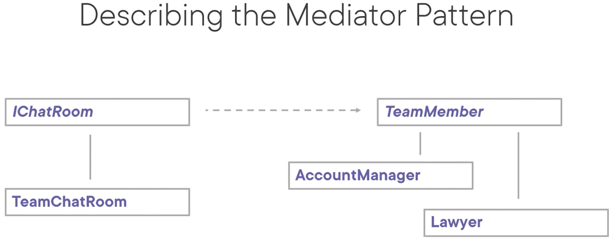

# Mediator Pattern
The intent of this pattern is to define an object - the mediator - that encapsulates how a set of objects interact. It does that by forcing objects to communicate via that mediator.

MediatR is a very popular nuget package that is used widely to implement the mediator pattern.

Use cases:
- When a set of objects communicate in well-defined but complex ways
- When, because an object refers to and communicates with many other objects, the object is difficult to reuse
- When behavior that's distributed between several classes should be customizable without a lot of subclassing (the mediator localizes behavior that otherwise has to be distributed across several classes)

Pattern consequences:
- Limits subclassing
- Decouples colleagues
- Simplifies object protocols (interactions between objects that were many-to-many are not one-to-many between mediator and its colleagues)
- OCP: new mediators can be introduced without having to change components
- Centralizes control, which can make the mediator turn into a monolith

Related patterns:
- Facade: mediator abstracts communication between objects. Facade abstracts the interface to the subsystem objects to promote ease of use.

Patterns that connect senders and receivers:
- Chain of Responsibility: passes a request along a chain of receivers
- Command: connects senders with receivers unidirectional (e.g. button in UI)
- Mediator: eliminates direct connections altogether
- Observer: allows receivers of requests to (un)subscribe at runtime