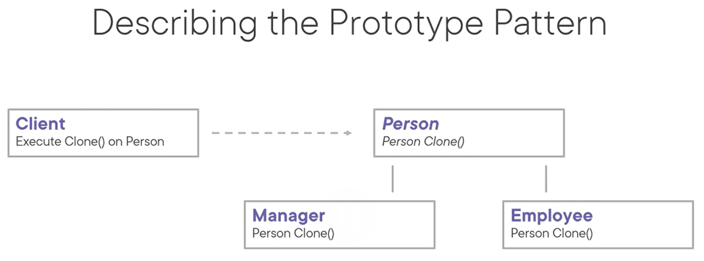
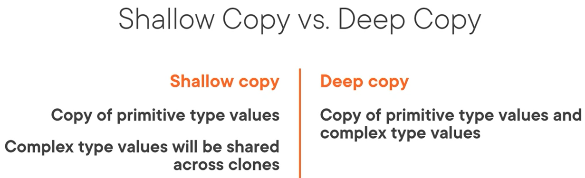

# Prototype Pattern
The intent of this pattern is to specify the kinds of objects to create using a prototypical instance, and create new objects by copying this prototype.

- A shallow copy is a copy of primitive type values, while a deep copy is a copy of primitive type values and complex type values.

Use cases:
- When a system should be independent of how its objects are created, and to avoid building a set of factories that mimics the class hierarchy.
- When a system should be independent of how its object are created, and when instances of a class can have one of only a few different combinations of states. In those cases starting from a clone will often be more convenient than starting with an instance with default values.

Pattern consequences:
- Prototype hides the ConcreteProduct classes from the client, which reduces what the client needs to know.
- Reduced subclassing.
- Each implementation of the prototype base class must implement its own clone method.

Related patterns:
- Abstract factory: a factory might store a set of prototypes from which it clones when a new instance is requested.
- Factory method: factory method is based on inheritance, but doesn't require an initialization step.
- Singleton: prototype can be implemented as a singleton.
- Composite: can use prototype for convenient object creation.
- Decorator: can use prototype for convenient object creation.