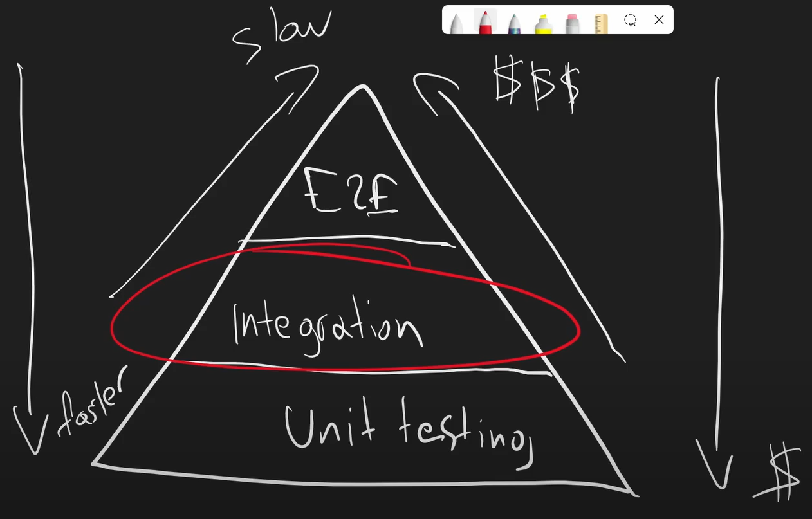

# From Zero to Hero: Integration testing in ASP.NET Core
My repo & notes for https://nickchapsas.com/p/from-zero-to-hero-integration-testing-in-asp-net-core

---
### Types of testing
- Unit tests run in a vacuum. They have no external dependencies (no db, network, filesystem calls) -- external dependencies are mocked and configured to either work or not work in specific ways.
- Component testing is just unit testing but with bigger scope. Also called narrow integration testing or functional testing. Test quite a few units together but all dependencies etc are mocked.
- Integration testing tests for points where your code integrates with other systems (your dependencies). Databases, file system, network, docker images, external APIs. These types of tests give you a more realistic idea of how your system performs. If you had to choose just unit or integration testing then integration testing gives you a better idea of how your application actually behaves in the real world.
  - Integration testing is done with a "top down" approach. Starting with the user input into the system and following the execution all the way to the database etc and back to the user.
- End to end (E2E) (or system testing) testing tests everything for real (usually in a staging environment before pushing to production). Nothing is mocked.
- Performance testing tests the performance and identified performance bottlenecks and shortcomings in our system.
  - Types: load, soak, spike, stress

### The testing pyramid
The testing pyramid is a way of describing the types and amounts of each type of test you should aim for. The lower you are in the period the cheaper ($ in man-hours, complexity) it is to work with and maintain.
Unit tests are super fast, integration tests are slower and E2E tests are much slower.
Unit tests are fast enough to be running in continuous mode (every time you save your code).

### Why should you write integration tests?
- Integration tests give you a better idea of how your system will actually perform when integrated with other components which is not something unit tests can do as they assume quite a lot via mocking/fakes in order to run in a vacuum
- Perfect mixture of high level and low level testing
- Many engineers prefer writing integration tests over unit tests because of how much value they bring and due to how much overlap there usually is between integration tests and unit tests
- They make it extremely easy to retroactively add tests in a system that is not easily testable (in a system where they aren't using DI/IoC containers, DIP/interfaces and other solid principles that make it easy to mock and test)

### What is in scope for integration testing?
- File system calls, database calls, calls to other APIs we own and control, but calls to real external APIs are proxied/faked
- Any dependencies that you dont own and cant control should be replaced with another API that we own
- 

### The 5 integration testing steps
1. Setup
   - Create database, spin up docker container, seed data into database etc -- whatever is going to be needed for the tests to run 
2. Dependency Mocking (API)
   - Not the same as unit testing mocks, this is usually about real APIs that you are consuming and you cant control, you want to mock and spin up a fake version of that API that you control
3. Test Execution
4. Assertion
5. Cleanup
   - Very important not to leave artifacts from your test executions on real database, filesystem etc 

### Test naming
- Create a class for the controller that the endpoints live in "CustomerControllerTests"