# From Zero to Hero: Unit testing for C# Developers
My repo & notes for https://nickchapsas.com/p/from-zero-to-hero-unit-testing-in-c

Note: Picture embeds are displaying in Rider but not GitHub at the moment.
---

Tests are code that validates the behaviour of other code.

- Unit Testing
  - Tests what is called the "Unit". Usually a method or class.
  - In unit testing any I/O call (to file system, database etc) is mocked so that unit tests can remain fast and don't depend on anything.
  - It is not uncommon to try go wider with your unit tests while still keeping them in unit test scope -- sometimes called a 'component' and called component testing or 'functional testing' or 'narrow integration testing'.
  - Examples:
    - Checking that a method that splits a full name into a separate first and last name correctly converts 'Stewart Celani' into 'Stewart' and 'Celani'.
- Integration Testing
  - Testing the things that your system integrates with/depends on (databases, API, file system).
  - Actually calls dependencies.
    - Tests rely on an actual working environment or one that is spun up on demand (e.g. in docker or in memory).
  - For testing larger parts of a system.
  - Slower than unit testing.
- End to End Testing (E2E)
  - Test from beginning to end all parts of a system.
  - Slower, more business logic focused.
  - The idea is that you're validating the behaviour that the user calling your system would have
- Performance Testing / Load Testing
  - Validate the performance of an application

### Why is unit testing important?
The feedback loop of writing code and having very quick tests running against all changed code and getting immediate feedback is very powerful and stops most bugs from even getting close to production. 

Unit tests and code coverage give developers confidence to refactor code and be sure that they haven't accidentally introduced bugs/regressions into the system.

Some companies/people think testing is so important that they practice what is called 'Test Driven Development' (TDD) where the tests are written before writing actual code.

Unit tests are very important and are usually part of the CI/CD build pipeline. If any tests fail the whole build fails.

Many big companies have mandatory code coverage requirements before being able to commit code.

### The testing pyramid
The testing pyramid is a way of describing the types and amounts of each type of test you should aim for.
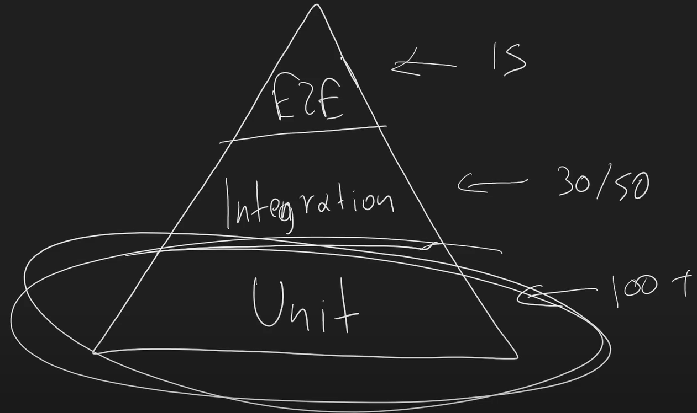

### The 3 core unit testing concepts
1. Testing Library
   - **xUnit** 
     - The most popuplar unit testing library. Created by the creators of nUnit. Used by Microsoft themselves.
   - nUnit
   - MSTest
2. Mocking Library
   - **NSubstitute**
   - Moq
   - FakeItEasy
3. Assertion Library
   - **Fluent Assertions**
   - Built-in Assert 
   - Shouldly

This course will use xUnit, NSubstitute and Fluent Assertions.

### Project structure & naming conventions
- Project structure should have src and test folder also represented by solution folders

- Test project name should be: NameOfProject.Tests.{TypeOfTest} (e.g. CalculatorLibrary.Tests.Unit, CalculatorLibrary.Tests.Integration)
- Class name should be the name of the class being tested with 'Tests', if the 'Calculator.cs' class was being tested the test file name should be 'CalculatorTests.cs'
- Test methods names should start with the name of the method they are testing then follow the 'Should... When' approach (e.g. Add_**Should**AddTwoNumbers_**When**TwoNumbersAreIntegers)
- This is how Nick sees unit tests being named in the real world at big companies in the UK
- Sometimes people will put an underscore after each word but that is personal preference

### Arrange, Act, Asset
- Tests are usually arranged into the AAA format, its good to set up an aaa code snippet in your IDE of choice.
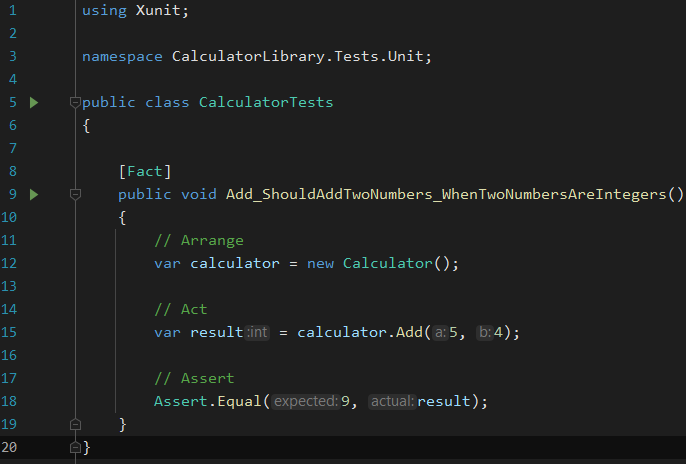

### xUnits Test Execution Model
- The thing being tested/'acted' upon is called the 'system under test' or 'sut'
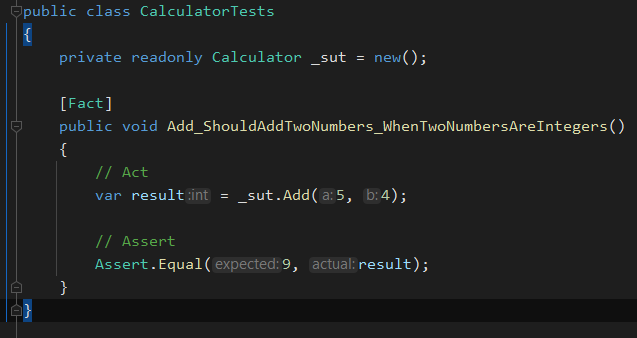
- A new instance of the test class is created on execution of each test
- It ensures every tests scope is self contained and one execution of a unit test wont have side effects on the execution of another

### Test Setup and Teardown
- Any setup you need should be done via the constructor, xUnit will automatically inject dependencies using DI
- Cleanup should be done via implementing the IDisposable interface
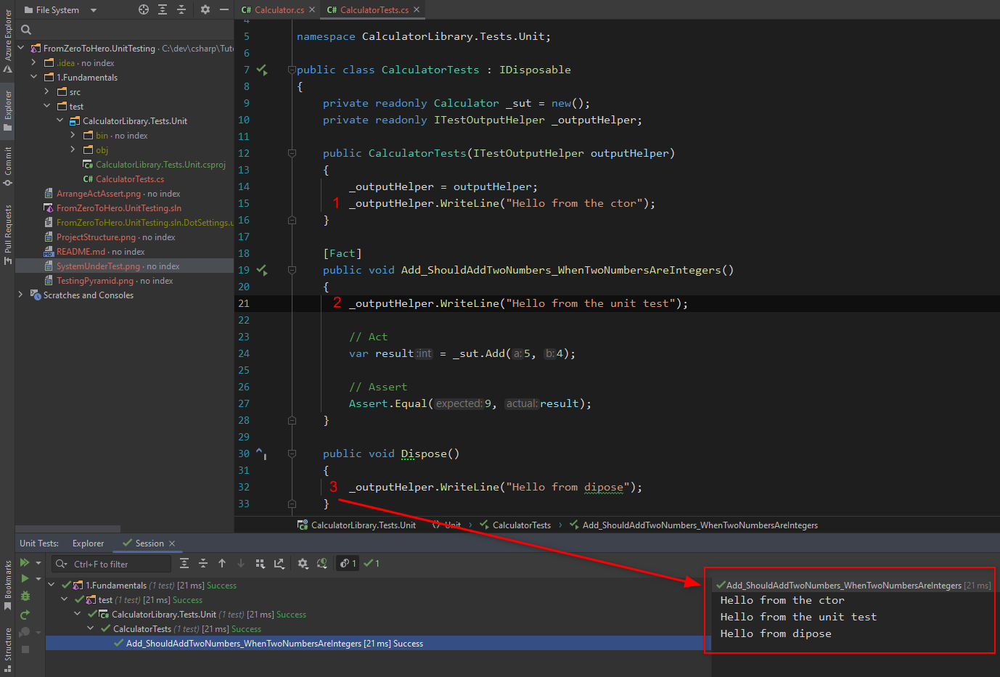
- What if you have async code in your setup or teardown? (especially useful for Integration tests)
  - Implement the IAsyncLifetime interface which required implementing InitializeAsync and DisposeAsync methods
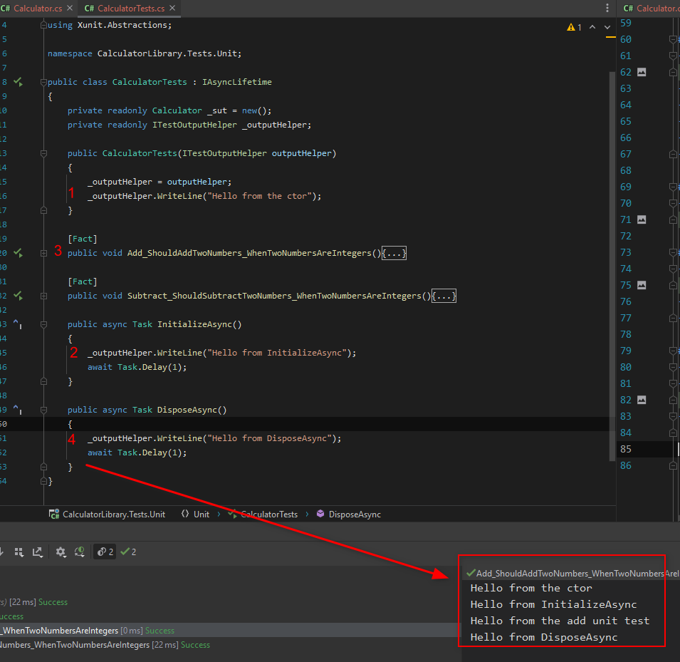

### Parameterizing Tests
- Change [Fact] to [Theory] and use [InlineData(param 1, param 2)] etc
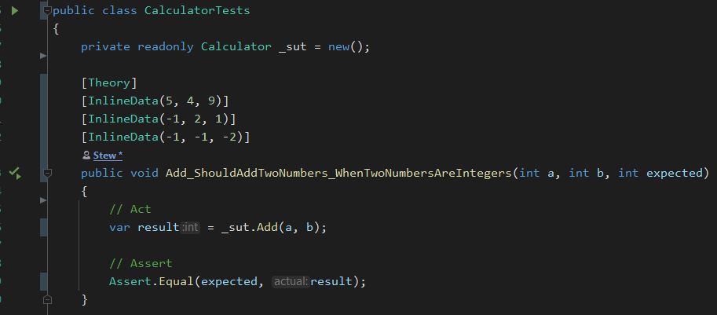

### Skipping Tests
- [Theory(Skip = "This breaks in CI")] or [InlineData(1,1,1, Skip="This breaks in CI")]

### Making internals visible to test project
- Old way was: [assembly: InternalsVisibleTo("TestingTechniques.Tests.Unit")]
- New way is in the csproj by adding InternalsVisibleTo Include="TestingTechniques.Tests.Unit within an ItemGroup

### Fakes vs Mocking
- Faking interfaces is good in some scenarios but not as flexible as mocking as you would have to create a new fake for each test you wanted to do
- Mocking is more flexible
- Mocks are in-memory implementations of an interface or abstract classes that allow us to specify behavior or functionality
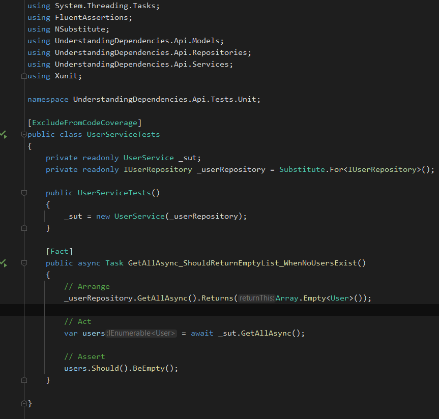

### Testing in the Real World (AspNetCore APIs)
- Data layer/repository tests are more integration test things than unit tests as if the database is mocked then the whole repository method is usually mocked and at that point "what are we testing really?".
- Most the tests will be on services.
- There is debate on whether the API layer (Controllers) should also be tested
  - Domain to contract mapping is good to test (Request to domain and domain to response)
  - You want to verify the behavior of your API if an entity is not found or if an entity exists -- does the correct 404 get thrown? Or does an exception get thrown which gets translated to a 404?
  - Nick has worked with people who hate these sort of unit tests and think they should be purely on an integration test level
- With "Untestable Code" such as the ILogger (extension methods in third-party packages can be hard to test) you can use a wrapper/adapter that can be tested to verify calls have been made

### Class & Collection Fixtures
- If a class needs shared state/context (often with end to end or integration tests that need to share database, data, docker connection etc) you implement IClassFixture<TClass>
- The constructor in the fixture is also shared only once, and if IDisposable is implement on the fixture you can implement teardown logic
- Order:
  1. Constructor of fixture (shared setup code for tests)
  2. Constructor of the test class
  3. Test itself
     - NOTE 2 and 3 will be called for each test sequentially
     - e.g. with 2 tests it'll be 1, 2, 3, 2, 3, 4
  4. Dispose on the fixture (shared teardown code for tests)
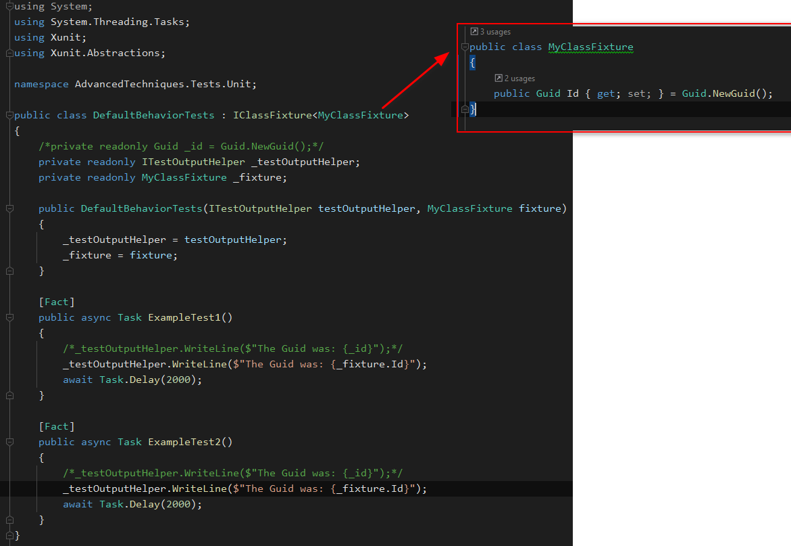
- CollectionFixtures can be used to share state between multiple classes
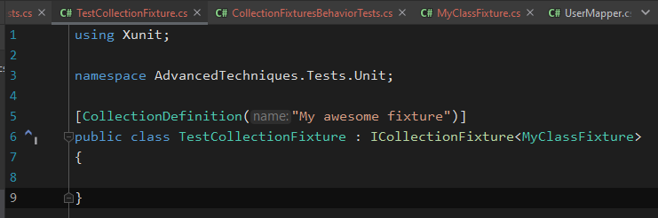
- To use it on classes and have the fixture available to inject via DI you have to use the [Collection("My awesome collection fixture")] and match the name to whatever name is set on your CollectionDefinition -- in this case [CollectionDefinition("My awesome collection fixture")]

### Test Parallelization
- By default different classes run their tests as a collection and collections do not run their tests sequentially
- The default test behavior is [assembly: CollectionBehavior(CollectionBehavior.CollectionPerClass)]
- It can be changed to [assembly: CollectionBehavior(CollectionBehavior.CollectionPerAssembly)] (Nick has never had to do this)
- You can use [assembly: CollectionBehavior(DisableTestParallelization = true)] to turn off parallelization completely if you want, it is more often than not that you are doing something wrong with your tests
- The max degree of parallelism can be changed like [assembly: CollectionBehavior(MaxParallelThreads = 32)]
- You can disable parallelization on the CollectionDefinition via [CollectionDefinition("My awesome collection fixture", DisableParallelization = true)]

### Advanced Parameterization
- Instead of [InlineData] you can use a [MemberData(nameof(MethodName))] class to generate an enumerable of test parameters
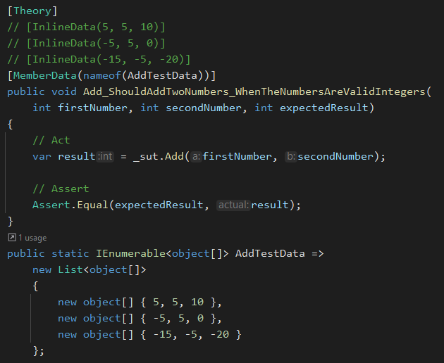
- You can also use [ClassData(typeof(MethodName))] if you need to use a whole class to dynamically generate test data
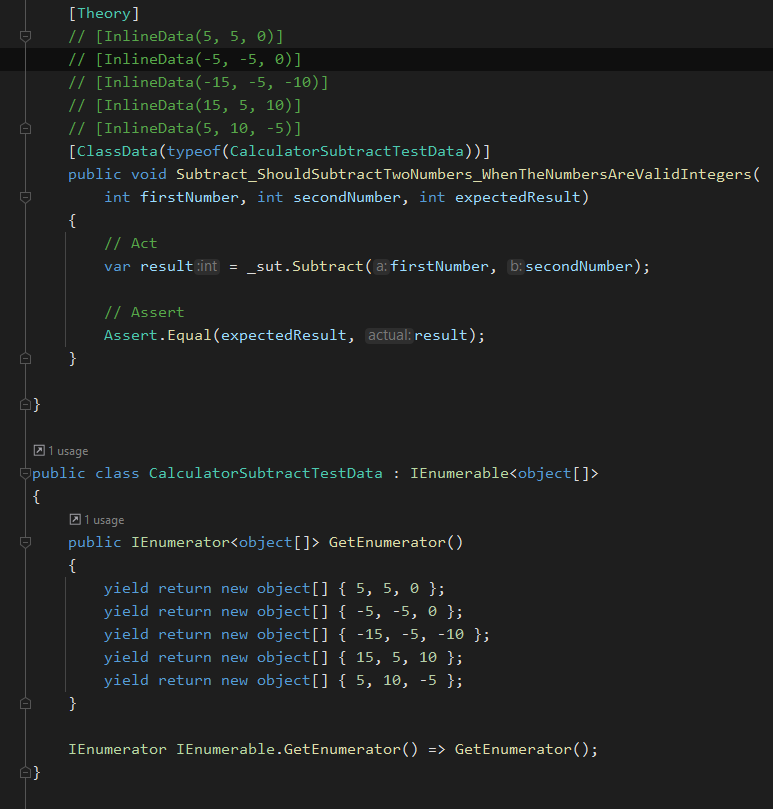

### Test Execution Timeouts
- [Fact(Timeout = 2000)] If this test takes longer than 2 seconds it will fail with "Test execution timed out after 2000ms"

### Testing Date and Time
- It is very common to implement an IDateTimeProvider and DateTimeProvider in your project that you can then mock and tell to return whatever datetime you need in your tests

### Code Coverage
- In Rider you can Cover All Tests and run continuious testing Cover New and Outdated Tests
- To run code coverage from an external tool (CI/CD)
- dotnet tool install -g coverlet.console
- coverlet .\4.RealWorld\test\Users.Api.Tests.Unit\bin\Debug\net6.0\Users.Api.Tests.Unit.dll --target "dotnet" --targetargs "test --no-build"
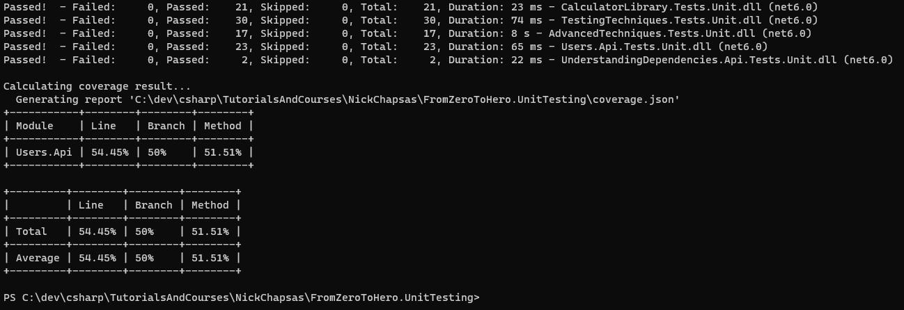
- The external tool will output a json file which can be used to generate a coverage.cobertura.xml file which can be consumed by other tools
- To specifically generate it using coverlet use: dotnet test --collect:"XPlat Code Coverage" which will output a TestResults folder
- To exclude classes from code coverage use [ExcludeFromCodeCoverage] that is respected by IDE specific code coverage and external tools
- Instead of putting CodeCoverage specific attributes in code you can also pass exclude to coverlet:
coverlet .\4.RealWorld\test\Users.Api.Tests.Unit\bin\Debug\net6.0\Users.Api.Tests.Unit.dll --target "dotnet" --targetargs "test --no-build" --exclude "[*]Users.Api.Repositories*"
- Finally, to generate using cmd on windows:
  - dotnet tool install -g dotnet-reportgenerator-globaltool
  - reportgenerator -reports:".\TestResults\21cce97e-9392-4390-8e24-0fbb8d742a35\coverage.cobertura.xml" -targetdir:"codecoverage" -reporttypes:Html
