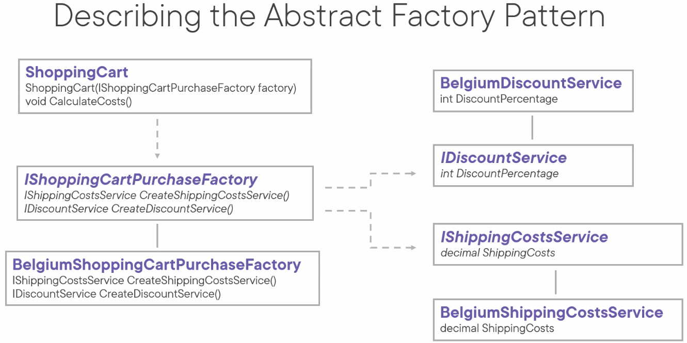
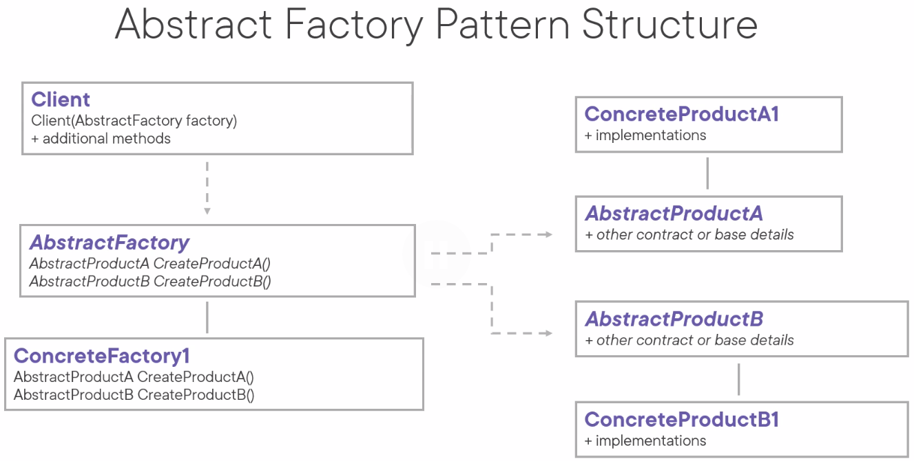

# Abstract Factory Pattern
The intent of the abstract factory pattern is to provide an interface for creating families of related or dependent objects without specifying their concrete classes.




- Example of a problem that this pattern can solve:
````
var australianDiscountService = new AustralianDiscountService();
var discount = australianDiscountService.DiscountPercentage;

var australianShippingCostsService = new AustralianShippingCostsService();
var shippingCosts = australianShippingCostsService.ShippingCosts;
````
- Use an abstract base class when you need to provide some basic functionality that can potentially be overridden
- Use an interface when you only need to specify the expected functionality of a class
- Provide a concrete factory implementation via the constructor
- The client is decoupled from the concrete factory implementation

Use cases:
- When a system should be independent of how its products are created, composed and represented
- When you want to provide a class library of products and you only want to reveal their interfaces, not their implementations
- When a system should be configured with one of multiple families of products
- When a family of related product objects is designed to be used together and you want to enforce this constraint

Pattern consequences:
- It isolates concrete classes, because it encapsulates the responsibility and the process of creating product objects
- Adheres to open/closed principle (OCP): new products can easily be introduced without breaking code
- Adheres to single responsibility principle (SRP): Code to create products is contained in one place
- It makes exchanging product families easily, only need to switch out one line of instantiating code
- It promotes consistency among products (products in the same family are created by the same factory)
- Supporting new kinds of products is rather difficult
  - If you want to extend the abstract factory you also have to change the interface which means changing the implementation of all of its subclasses
 
