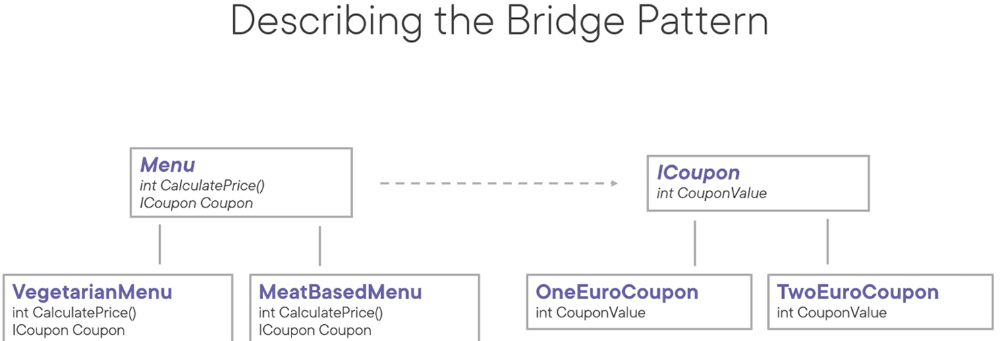
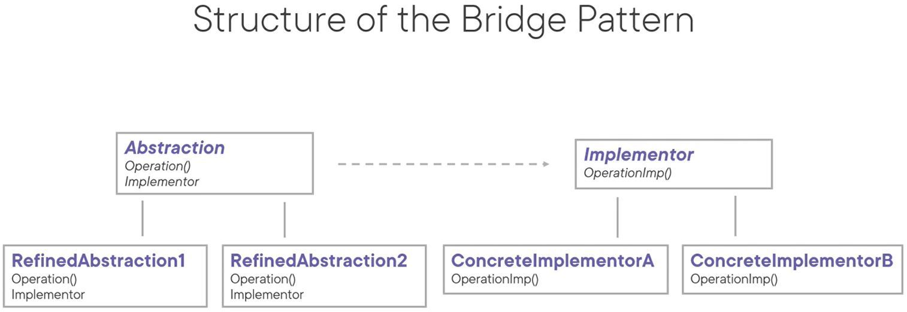

# Bridge Pattern
The intent of this pattern is to decouple an abstraction from its implementation so the two can vary independently.

- Separate abstraction from implementation
- A means to replace an implementation with another implementation without modifying the abstraction
- Subclassing is one way to add functionality but subclassing tends to add avoidable complexity
 

Use cases:
- When you want to avoid a permanent binding between an abstraction and its implementation (to enable switching implementations at runtime)
- When abstraction and implementations should be extensible by subclassing
- OCP: When you don't want changes in the implementation of an abstraction to have an impact on the client

Pattern consequences:
- Decoupling: the implementation isn't permanently bound to the abstraction
- OCP: As the abstraction and implementation hierarchies can evolve independently, new ones can be introduced
- You can hide implementation details away from clients
- SRP: you can focus on high-level logic in the abstraction, and on the details in the implementation

Related patterns:
- Abstract factory: factory can create and configure a bridge
- Adapter: adapter lets unrelated classes work together, bridge lets abstractions and implementations vary independently