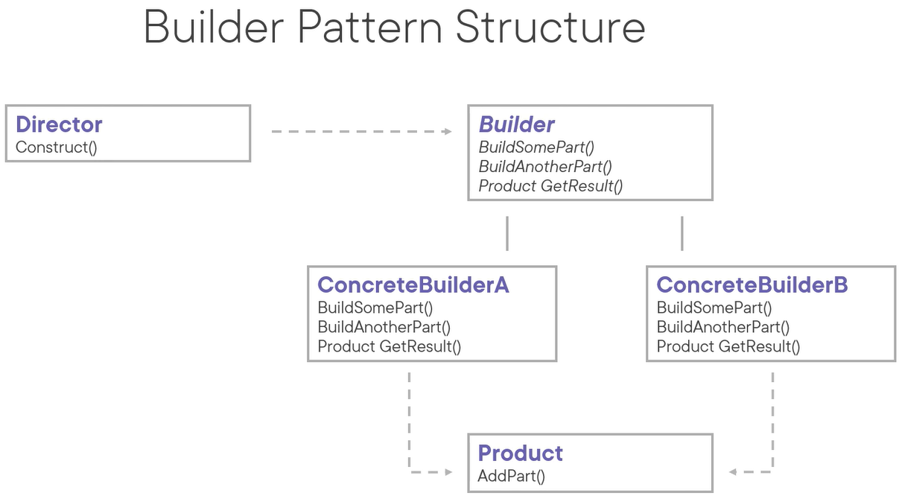

# Builder Pattern
The intent of the builder pattern is to separate the construction of a complex object from its representation. By doing so, the same construction process can create different representations.

 
Use cases:
- When you want to make the algorithm for creating a complex object independent of the parts that make up the object and how they're assembled.
- When you want the construction process to allow different representations for the object that's constructed.

Pattern consequences:
- It lets us vary a products' internal representation.
- Adheres to single responsibility principle (SRP): it isolates code for construction and representation; it thus improves modularity by encapsulating the way a complex object is constructed and represented.
- It gives us finer control over the construction process.
- Leads to uniform end-product.
- Downside: complexity of code base increases.

Related patterns:
- Abstract factory: both can be used to construct complex objects, but the builder constructs the complex objects step by step.
- Singleton: a builder can be implemented as a singleton.
- Composite: composites are often built by builders.