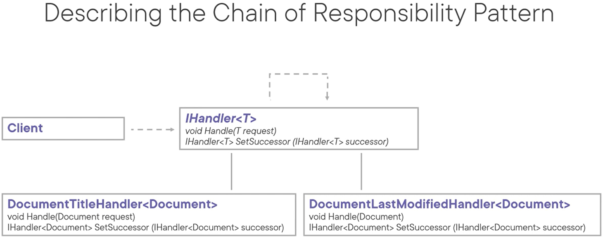
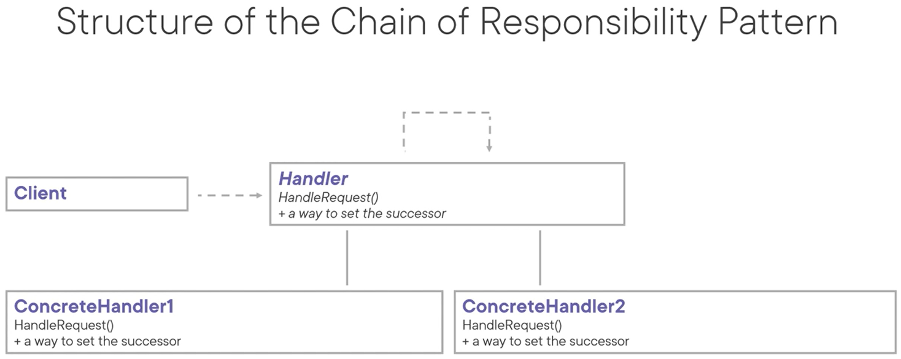

# Chain of Responsibility Pattern
The intent of this pattern is to avoid coupling the sender of a request to its receiver by giving more than one object a chance to handle the request. It does that by chaining the receiving objects and passing the request along the chain until an object handles it.

A good example is **middleware**.

Use cases:
- When more than one object may handle a request and the handler isn't known beforehand
- When you want to issue a request to one of several objects (handlers) without specifying the receiver explicitly
- OCP: When the set of objects that handle a request should be specified dynamically (all handlers and the order of the handlers is set at runtime)

Pattern consequences:
- SRP: Reduced coupling and works towards a single responsibility per class
- Adds flexibility in regards to assigning responsibilities to objects
- It does not guarantee receipt of the request

Related patterns:
- Composite: the parent of a leaf can act as the successor
- Command: chain of responsibility handlers can be implemented as commands

Patterns that connect senders and receivers:
- Chain of Responsibility: passes a request along a chain of receivers
- Command: connects senders with receivers unidirectional (e.g. button in UI)
- Mediator: eliminates direct connections altogether
- Observer: allows receivers of requests to (un)subscribe at runtime