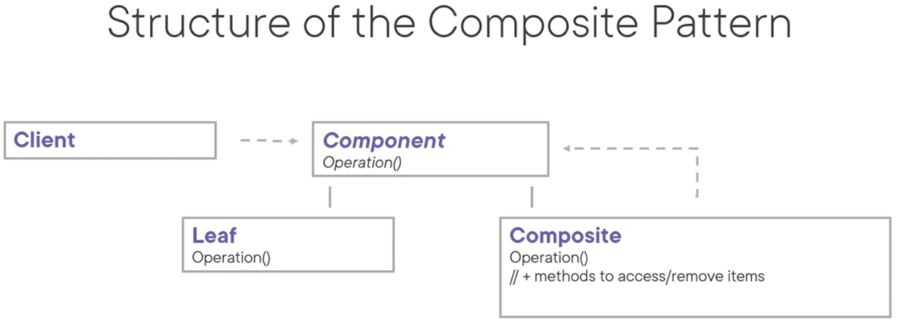

# Composite Pattern
The intent of this pattern is to compose objects into tree structures to represent part-whole hierarchies. As such, it lets clients treat individual objects and compositions of objects uniformly: as if they were all individual objects.

Examples:
- XML document structure
- Composing a drawing
- File system
````
public class File {}
public class Directory {
    public IEnumerable<File> Files { get; } = new()
    public IEnumerable<Directory> Subfolders { get; } = new()    
}
````




Pattern consequences:
- Makes the clients simple
- OCP: easy to add new kinds of components
- Can make the overall system too generic

Related patterns:
- Chain of responsibility: leaf components can pass a request through a chain of all parent components
- Iterator: can be used to traverse composites
- Visitor: can be used to execute an operation over the full composite tree