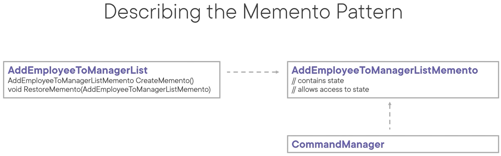
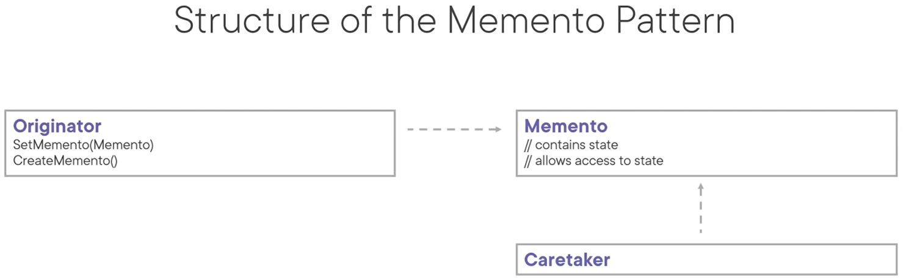

# Memento Pattern
Sometimes called the **token** pattern.

The intent of this pattern is to capture and externalize an object's internal state so that the object can be restored to this state later, without violating encapsulation.

Use cases:
- When part of an objects state must be saved so it can be restore later on
- AND when a direct interface to obtaining the state would expose implementation details and break encapsulation

Pattern consequences:
- It preserves encapsulation boundaries
- It simplifies the originator
- Using mementos might be expensive
- It can introduce complexity to your code base

Related patterns:
- Command: can use a memento to store and restore its state
- Iterator: memento can be used to capture the current iteration state and potentially roll it back