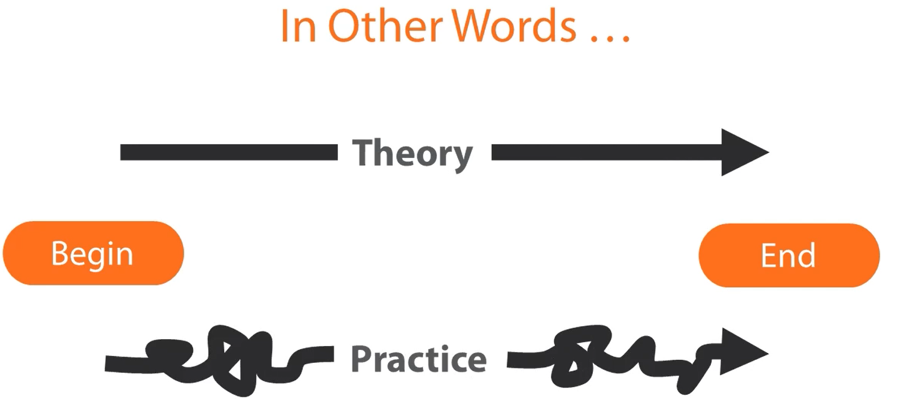
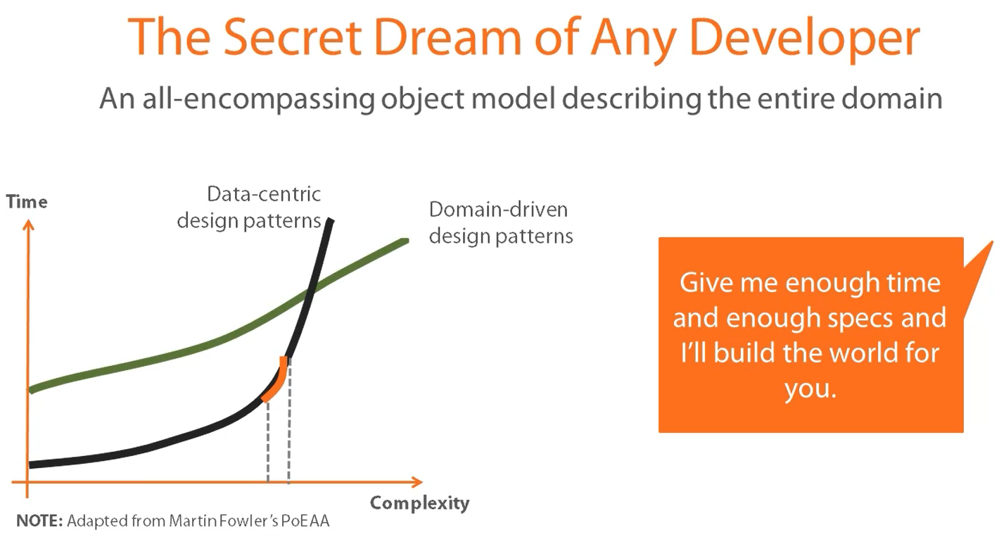

# Modern Software Architecture: Domain Models, CQRS, and Event Sourcing
by Dino Esposito

https://app.pluralsight.com/library/courses/modern-software-architecture-domain-models-cqrs-event-sourcing/table-of-contents

---

### DDD At a Glance
#### Domain-driven Design in History
- Introduced 10+ years ago by Eric Evans in the "blue book"
- Primary intent of tackling complexity in the heart of software
- Was perceived as an all or nothing approach to application design
- Wonderful idea
- Not a mere promise
- Not really hard to do right
- But just easier to do wrong
- Started in the Java space, only recently picked up in .NET world

#### Where does complexity come from? How is software written without DDD?
1. Make sense of requirements
2. Build a (relational) data model
3. Identify relevant tasks and data tables
4. Build a user interface for each task
5. Close to what users wanted but not so close enough to pass acceptance tests
#### Lack of domain knowledge makes writing (complex) software an unmanageable process
- Past a certain threshold even the smallest change has a significant cost to it
- **Big Ball of Mud (BMM)** is a common term/reference for such problematic software:
  - A system that's largely unstructured, padded with hidden dependencies between parts, with a lot of data and code duplication and un unclear identification of layers and concerns - a spaghetti code jungle
#### DDD is Still about Business Logic
1. Crunch knowledge about the domain
2. Recognize subdomains
3. For each subdomain design a rich domain model
4. Code by telling objects in the domain model what to do

### Discovering the Domain Architecture through DDD
#### Ubiquitous Language
- A common vocabulary to express models and processes
- Vocabulary of domain-specific terms
  - Nouns, verbs, adjectives, idiomatic expressions and even adverbs
- Shared by all parties involved in the project
  - Primary goal of avoiding misunderstandings
- Once defined, used in all forms of spoken and written communication
  - Universal language of the business as done in the organization
  - User stories are written edited and advised in the ubiquitous language
  - Meetings
  - Emails
  - Technical documentation
  - Schedule
  - Source code
- List of terms saved to office documents, glossary of terms fully explained, made available to everyone, part of the project documentation
- Continuously updated - responsibility of the development team
- **Discovering** the ubiquitous language leads you to **understand** the business domain in order to **design** a model
- Start from User Requirements
- A plausible user story:
  - "As a registered customer of the I-Buy-Stuff online store, I can redeem a voucher for an order I place so that I don't actually pay for the ordered items myself."
    - Domain:
      - Registered Customer
      - Voucher
      - Order
      - Ordered Items
- Software experts vs domain experts (from different parts of the business in question) tend to use different language:
  - Delete the booking -> Cancel the booking
  - Submit the order -> Checkout
  - Update the job order -> Extend the job order
  - Create the invoice -> Register/Accept the invoice
  - Set state of the game -> Start/Pause the game
- No Ambiguity. No synonyms.
  - "Extra threshold costs should be emphasized in the user account"
    - What's really meant here?
      - Show costs when the user logs in?
      - List costs in a detail page?
      - Mark extra costs in the bill?
      - Other? Specify...
- Domain experts and dev teams meet in the middle, combine business and technical jargon to create the ubiquitous language
  - Expected to contain mostly business terms but some technical concepts are allowed to make sure that the final language fits system behaviour
- Software experts are responsible for keeping the ubiquitous language and the code in sync

#### Bounded Context

#### Context Map

