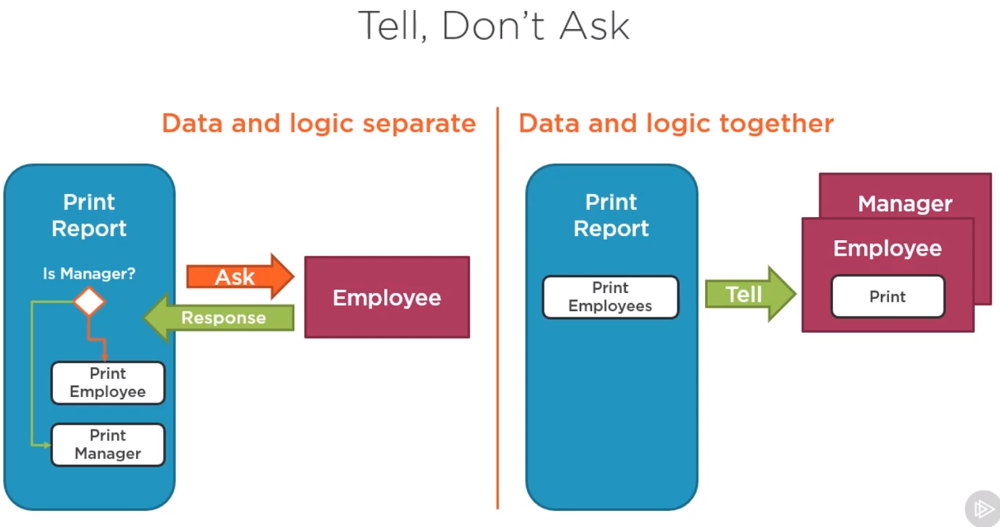

### [SOLID Principles for C# Developers](https://app.pluralsight.com/library/courses/csharp-solid-principles/table-of-contents) by Steve Smith

It's easy to write software that fulfills its users' immediate needs, but is difficult to extend and maintain. Such software becomes a burden for companies striving to remain competitive. In this course, SOLID Principles for C# Developers, you will learn five fundamental principles of object-oriented design that will keep your software loosely coupled, testable, and maintainable. First, you will see how to keep classes small and focused, and how to extend their behavior without having to edit their source code. Then, you will discover the importance of properly designing interfaces and abstractions in your systems. Finally, you will explore how to arrange dependencies in your system so different implementations can be added or plugged in as needed, allowing a truly modular design. When you are finished with this course, you will understand how to build maintainable, extensible, and testable applications using C# and .NET.

1. **SRP - Single Responsibility Principle**
   - Each software module should have one *and only one* reason to change
   - Classes should encapsulate doing a particular task in a particular way
   - Multipurpose tools don't perform as well as dedicated tools
   - Dedicated tools are easier to use
   - A problem with one part of a multipurpose tool can impact all parts
   - Examples of a 'responsibility':
     - Persistence
       - Might need to change from files to database or from one database to another
     - Logging
       - May prove insufficient and a new framework or provider may need to be added
     - Validation
       - Validation rules or the way validation is performed may need to be updated in the future
     - Business Logic
   - Responsibilities change at different times for different reasons. Each one is an axis of change.
   - Modules should be as loosely coupled as possible
   - Separation of Concerns; keep plumbing code separate from high level business logic
   - Class elements that belong together are **cohesive**. Classes that have many-responsibilities will tend to have less cohesion than a class with a single responsibility.
   - Relationships within each class represent cohesion, while relationships between classes are represent coupling. In many cases, loose coupling is preferred as it represents code that is easier to change and test.
   

2. **OCP - Open/Closed Principle**
  - Software entities (classes, modules, functions, etc.) should be open for extension, but closed for modification.
  - Dr. Bertrand Meyer originated the term in his 1988 book, *Object-Oriented Software Construction*.
  - It should be possible to change the behavior of a method without editing its source code.
  - Open to extension:
    - New behavior can be added in the future
    - Code that is closed to extension has fixed behavior
  - Closed to modification:
    - Changes to source or binary code are not required
    - The only way to change the behavior of code that is closed to extension is to change the code itself
  - Why should code be closed to modification?
    - Less likely to introduce bugs in code we don't touch or redeploy
    - Less likely to break dependent code when we don't have to deploy updates
    - Fewer conditionals in code that is open to extension results in simpler code
    - Bug fixes are ok
  - In the real-world there is a balance between abstraction and delivering working code in time and on budget
  - Keep in mind that code that is extensible in any direction is infinetly abstract, you need to balance abstraction and concreteness
  - Abstraction adds complexity
  - We want applications that will flex in the ways we need to as they are maintained and extented
  - We need to be able to predict where that variation will be needed and apply abstraction as needed
  - You don't want to have to create a system with too much complexity up-front that is trying to guess at every-which way things may be extended in future because it will be overly complex and difficult to work with
  - Example code: how do we add another policy type?
  - Typical approaches to OCP:
    - Parameters
    - Inheritance, including virtual methods that can be overriden
    - Using Interfaces that can be swapped out
    - Composition (factories)
    - Dependency Injection (this is where .NET 6 and injecting interfaces everywhere that can be swapped out/mocked in tests that I'm familiar with comes in)
  - Prefer implementing new features in new classes.
    - Design class to suit problem at hand
    - Nothing in the current system depends on it
    - Can add behavior without touching existing code
    - Can immediately follow Single Responsibility Principle
    - Can be unit-tested (even if the existing system is a big ball of mud that is hard to test, your new classes should be testable from the start)

3. **LSP - Liskov Substitution Principle**
 - Subtypes must be substitutable for their base types.
 - Square : Rectangle is not substitutable for a rectangle everywhere a rectangle is used and violates LSP.
 - Detecting LSP violations in your code:
   - Type checking with is or as in polymorphic code. The biggest problem with this kind of code (below) tends to repeat itself. Each time you work with employees you may have to perform a check to see which type of employee it is and do something different for different subtypes (Manager, Director, Executive etc). Each time you add a new type you may have to revisit all places where employee checks are going on to refactor. This also violates OCP.
   ````
   // LSP Violation:
   foreach(var employee in employees)
   {
        if(employee is Manager)
        {
            Helpers.PrintManager(employee as Manager);
            break;
        }
        Helpers.PrintEmployee(employee);
   }  
   
   // Corrected v1:
   foreach(var employee in employees)
   {
        employee.Print();
   }
   
   // Corrected v2:
   foreach(var employee in employees)
   {
        Helpers.PrintEmployee(employee);
   }
   ```` 
   - Null checks
   ````
   foreach(var employee in employees)
   {
        if(employee is null)
        {
            Console.WriteLine("Employee not found.");
            break;
        }
        Helpers.PrintEmployee(employee);
   }
   ````
   - NotImplementedException
 - Fixing LSP violations:
   - Follow the "Tell, Don't Ask" principle; don't ask instances questions about their type, encapsulate that logic in the class itself and tell it to perform an action
   
   - Minimize null checks with
     - C# features
     - Guard clauses
     - Null Object design pattern
   - Follow ISP and be sure to fully implement interfaces

4. **ISP - Interface Segregation Principle**
- Clients (calling code) should not be forced to depend on methods they do not use. 
- Prefer small, cohesive interfaces to large, "fat" ones.
- Violating ISP results in classes that depend on things they don't need and don't use which increases coupling and makes it harder to swap out implementations.
- More dependencies means:
  - More coupling
  - More brittle code
  - More difficult to test (fake implementations will require more work and the code using the interfaces would be more tightly coupled)
  - More difficult deployments
- Detecting ISP violations in your code:
  - Look for "large" interfaces (remember to follow pain driven development)
  - Look for not-implemented exceptions
  - Code uses just a small subset of larger interface
- Remember PDD (pain-driven development); you shouldn't automatically start breaking up every interface just because of ISP. Use the principle to fix sources of pain you're experiencing with the codebase. Pre-emptively using ISP everywhere will end up with a bunch of single method interfaces that are hard to use together and understand than a few cohesive interfaces.
- Fixing ISP violations:
  - Break up large interfaces into smaller ones
    - Compose fat interfaces from smaller ones for backwards compatibility 
      - INotificationService : IEmailNotificationService, ITextNotificationService instead of just an INotificationService that has a SendEmail and SendText method that all instances would need to implement even if they just needed one feature.
  - To address large interfaces you don't control
    - Create a small, cohesive interface (adapter design pattern) that you control. Your code should work with your adapter which in turn works with the original large interface. Only the adapter should know about the large interface.
  - Clients should own and define their interfaces

5. **DIP - Dependency Inversion Principle**

After watching this course you might be tempted to use these principles everywhere, for everything.

Instead, to really learn the principles you should practice PDD.

#### Pain Driven Development (PDD)

- Don't try to apply all the SOLID principles up-front
- Develop using the simplest methods you know
- Avoid premature optimization
- If the current design is painful to work with, use the principles to guide redesign